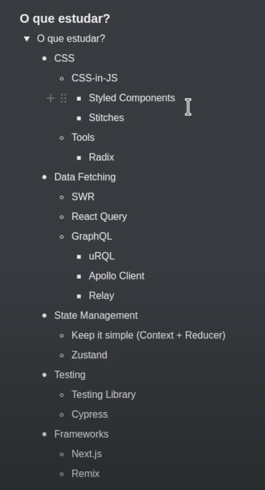

# react-ts
React TS with Vitejs & Snowpack


# Vitejs

Ao invés do webpack (que fazia todo aquele trabalho de ler os requires e gerar os minify dos JS e CSS que os browsers não entendiam) hoje usar o Vitejs e o Snowpack que implementam o ESMODULE.

No caso aqui usamos o template react-ts

https://vitejs.dev/guide/#trying-vite-online

# React

1. React: pode ser usado em qualquer local como mobile, tv, rv...
1. React-dom: é a parte do React especificamente para web browser
1. Tudo no React é um **componente** e os **componentes** são "renderizados" colocando o nome do **componente** dentro de uma tag <ComponetName> sendo que o nome do **componente** é camel case para diferenciar de tags html
1. O **componente** é uma função que retorna html
1. Quando o html tem mais de uma linha retornar dentro de ()
1. Não pode retornar uma série de **componentes** sem encapsular eles com um html então por exemplo colocar uma div
1. **Propriedades** nos **componentes** são o mesmo que os atributos de tags no HTML
1. Para atualizar uma variável que atualize a tela é usado o **useState**
1. OBS.: ao usar TypeScript tem que dizer a tipagem do **useSate**, bem como inicializá-lo (no caso aqui está inicializando com uma array vazia): ``` const tweets = useState<string[]>([]); ```
1. Como o react utiliza o principio da imutabilidade, ele não altera o valor em si da variável, ele dá um replace, por isso o useState retorna dois valores sendo um a variável (valor mais recente) e o outro que é a variável para repor/sobrescrever o valor atual: ``` const [tweets, setTweets] = useState<string[]>([]); ```
1. **Loop** no react (lembrando que usamos o {var} para imprimir um valor JS no HTML): ``` {tweets.map(tweet => { return <Tweet text={tweet}/> })} ```
1. **Funções/Ações**: 

## Exemplo de **componente** com propriedades

```tsx
    type TweetProps = {
        text: string;
    }

    export function Tweet(props: TweetProps) {
        return (
            <div>{props.text}</div>
        );
    }
```

## Exemplo de chamada de **componente**

```tsx
    import { Tweet } from './Tweet';
    function App() {
    return (
        <div>
        <Tweet />
        <Tweet />
        <Tweet />
        </div>
    );
    }

    export default App
```

## Uso de estados no componente

```tsx
    import { useState } from 'react';
    import { Tweet } from './Tweet';

    function App() {
    const [tweets, setTweets] = useState<string[]>([
        'Tweet 1',
        'Tweet 2',
        'Tweet 3',
        'Tweet 4'
    ]);

    function createTweet() {
        setTweets([...tweets, `Tweet ${tweets.length+1}`]);
    }

    return (
        <div>
        {tweets.map(tweet => { return <Tweet text={tweet}/> })}

        <button onClick={createTweet}>Adicionar tweet</button>
        </div>
    );
    }

    export default App
```

## Estilização no React

1. Pode criar um arquivo .css e importar esse arquivo no .tsx: ``` import './App.css'; ```
1. CSS in JS: No próprio componente colocar uma propriedade "style" e passar um objeto JS que modifica os elementos do componente: ``` style={{color: 'white',border: 0,padding: '6px 12px',backgroundColor: '#8257e6'}} ```. No caso tem o {} de fora para dizer que vai passar JS dentro e o {} de dentro é um objeto JS que contempla o que será recebido pela propriedade style
1. 

## Roteamento

1. ReactRouter:
    1. Instalar: ``` $ yarn add react-router-dom ```

Arquivo de Rota:

```tsx
import { Catalog } from './pages/Catalog';
import { Cart } from './pages/Cart';
import { Tweets } from './pages/Tweets';
import {
    BrowserRouter as Router,
    Routes,
    Route
} from 'react-router-dom';

export function AppRoutes() {
    return (
        <Router>
            <Routes>
                <Route path="/catalog" element={<Catalog/>}/>
                <Route path="/cart" element={<Cart/>}/>
                <Route path="/tweets" element={<Tweets/>}/>
            </Routes>
        </Router>
    )
}
```

# index.html

no index.html tem um ``` <script type="module" src="/src/main.tsx"></script> ``` onde o module permite usar as funções de import e export do TS.

# TypeScript OO


# What Next React


# Components a serem usados

1. RadixUI (são elementos sem CSS e foco na usabilidade e acessibilidade da interação): https://www.radix-ui.com/
1. Data Fetching
    1. SWR
    1. React Query (tem como colocar cache de dados e também refazer chamadas da última navegação do usuário)
    1. GraphQL
        1. uRQL
        1. Apollo Client <--- **USAR ESTE**
        1. Relay
1. State Management (gerenciar estado entre vários componentes)
    1. Keep it simple (Context + Reducer)
    1. Zustand
1. Testing
    1. Testing Library (unit tests)
    1. Cypress (e2e)
1. Frameworks
    1. Next.js
    1. Remix